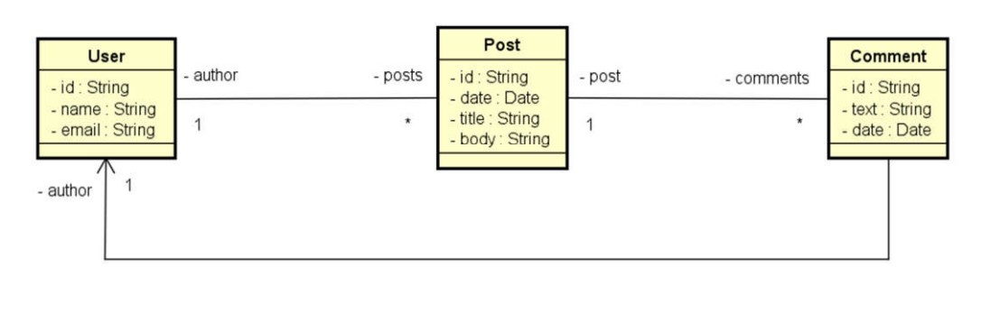

# Web Service com Springboot utilizando banco de dados MongoDB
[](https://github.com/RUNNN00/workshop-springboot-mongodb/blob/main/LICENSE)

Por [Ruan Azevedo](https://www.linkedin.com/in/ruan-azevedo-904203151)

## Sobre o projeto

Este é um projeto de aprendizagem das ferramentas **Springboot** e banco de dados **MongoDB**, curso organizado pela [DevSuperior](https://devsuperior.com "Site da DevSuperior") na plataforma
[Udemy](https://udemy.com)

Esta aplicação é um simples sistema de posts e comentários feitos por usuários. 

Os objetivos desse projeto consiste em:
- Compreender as principais diferenças entre paradigma orientado a documentos e relacional
- Implementar operações de CRUD
- Refletir sobre decisões de design para um banco de dados orientado a documentos
- Implementar associações entre objetos (aninhados e referências)
- Realizar consultas com Spring Data e MongoRepository

## Modelo conceitual


## Tecnologias utilizadas
- Java
- Spring Boot
- JPA / Hibernate
- Maven
- MongoDB

## Como executar o projeto
Pré-requisitos: Java 17 e MongoDB

[Instale o banco de dados MongoDB](https://www.mongodb.com/docs/manual/administration/install-community) na sua máquina e dentro dele,
crie um banco de dados com o nome *workshop_mongo*

```bash
# clonar repositório
git clone https://github.com/RUNNN00/workshop-springboot-mongodb.git

# entrar na pasta do projeto
cd workshop-springboot-mongodb

# executar o projeto
./mvnw spring-boot:run
```
Como este projeto retrata apenas o back-end, recomendo fazer as requisições GET utilizando a ferramenta [Postman.](https://www.postman.com)

Alguns exemplos de *endpoints*:

- http://localhost:8080/users
- http://localhost:8080/posts/titlesearch?text=bom%20dia
- http://localhost:8080/users/>>id_user<</posts
